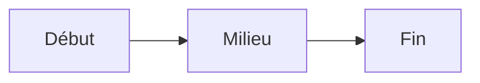

## Qu'est-ce que Markdown ?

**Markdown** est un langage de balisage léger créé en 2004 par John Gruber. Il permet d'écrire du texte formaté en utilisant une syntaxe simple et lisible, qui peut ensuite être converti en HTML ou d'autres formats.

L'objectif principal de Markdown est d'être facile à lire et à écrire, même dans sa forme brute. Ça nous arrange nous (les contributeurs.ices) parce que c'est simple à taper et à comprendre, et ça arrange les lecteurs.ices parce que c'est beau et bien mis en forme.
## Syntaxe de base

### Titres

```markdown
# Titre de niveau 1
## Titre de niveau 2
### Titre de niveau 3
```

Les titres séparent les parties de chaque article. Pensez aux sections sur Wikipédia!

### Formatage du texte

```markdown
**Texte en gras**
*Texte en italique*
~~Texte barré~~
`Code inline`
```

Comme dans Discord ou dans Whatsapp.
### Listes

```markdown
- Point 1
- Point 2
  - Sous-point 2.1
  - Sous-point 2.2

1. Premier élément
2. Deuxième élément
3. Troisième élément
```

### Liens

```markdown
[Texte du lien](https://exemple.com)

[[Lien vers une autre page du wiki]]
```

### Images

```markdown

```

Par exemple, 
```markdown

```
nous donne

### Citations

```markdown
> Ceci est une citation
> qui peut s'étendre sur plusieurs lignes
```

### Blocs de code

````markdown
```python
def hello():
    print("Hello World!")
```
````

## Fonctionnalités spécifiques au wiki

### Callouts (blocs d'attention)

Ce wiki supporte les callouts d'Obsidian :

```markdown
> [!NOTE]
> Ceci est une note informative

> [!TIP]
> Ceci est un conseil utile

> [!WARNING]
> Ceci est un avertissement

> [!ERROR]
> Ceci est une erreur
```

**Rendu :**

> [!NOTE]
> Ceci est une note informative

> [!TIP]
> Ceci est un conseil utile

> [!WARNING]
> Ceci est un avertissement

> [!ERROR]
> Ceci est une erreur
### Wikilinks

Les liens internes utilisent la syntaxe `[[Nom de la page]]` :

```markdown
Voir la page [[Git]] pour plus d'informations.
```

Vous pouvez aussi faire un lien à un titre dans la page, avec la syntaxe `[[Nom de la page#Titre]]` :
```markdown
Voir la sous-partie Logseq de la page [[Obsidian-Logseq]] à [[Obsidian-Logseq#Logseq]]
```

Vous pouvez aussi décider de ce qu'affichera le lien indépendamment de là où il pointe avec la syntaxe  `[[Nom de la page|Texte affiché]]`.
Par exemple, pour faire un lien vers la page [[Quartz]] qui afficherai "l'outil Quartz" à la place, on peut noter :
```markdown
Allez voir la page sur [[Quartz|l'outil Quartz]] !
```
### Frontmatter (métadonnées)

En haut de chaque fichier, ajoutez des métadonnées YAML :

```markdown
---
title: Titre de la page
tags:
  - formation
  - exercice
draft: false
---

Contenu de la page...
```

> [!TIP]
> Dans ce projet, la seule utilisation de ce système sera pour changer le titre d'une page. Par exemple, la page de base, [[index]], s'appelle "Bienvenue !".
### Diagrammes Mermaid

Créez des diagrammes directement en Markdown :

````markdown

````


### Formules mathématiques

Utilisez LaTeX pour les formules :

```markdown
Équation inline : $E = mc^2$

Équation en bloc :
$$
\int_{-\infty}^{\infty} e^{-x^2} dx = \sqrt{\pi}
$$
```

$$
\int_{-\infty}^{\infty} e^{-x^2} dx = \sqrt{\pi}
$$
## Éditer du Markdown

Vous pouvez éditer des fichiers Markdown avec :

- **[[Obsidian-Logseq]]** : éditeurs spécialisés avec prévisualisation (recommandé)
- **Éditeur Markdown spécialisé** : Marktext est sympa, Marker, etc...
- **VS Code ou n'importe que IDE** : éditeur de code avec extensions Markdown
- **GitHub** : directement dans l'interface web (pas recommandé, mais diablement pratique pour les gens qui ont pas envie de faire une version locale)
- **N'importe quel éditeur de texte** : Gedit, Notepad++, Sublime Text, etc.

## Ressources pour apprendre

> [!NOTE]
> J'ai compilé des sites que j'ai trouvé. Cette page devrait suffire, mais peut-être qu'à l'avenir on trouvera mieux.


- [Markdown Guide](https://www.markdownguide.org/) - Tutoriel complet
- [CommonMark](https://commonmark.org/) - Spécification standard
- [Markdown Cheatsheet](https://github.com/adam-p/markdown-here/wiki/Markdown-Cheatsheet) - Aide-mémoire

## Dans ce projet

Les fichiers Markdown du wiki se trouvent dans `source/content/` :

```
content/
├── index.md              # Page d'accueil
├── Formations/           # Notes sur les formations
│   ├── Formation de Formation en Impro.md
│   └── Exercices         # Exercices d'impro
├── Notions/              # Concepts théoriques
└── Méta/                 # Documentation du projet
```

Quand vous créez ou modifiez un fichier `.md`, [[Quartz]] le transforme automatiquement en page HTML avec navigation, recherche, backlinks et graphe de connaissances.

## Voir aussi

- [[Obsidian-Logseq]] - Éditeurs recommandés
- [[Quartz]] - Transformation en site web
- [[Git]] - Système de contribution de texte
- [[Comment contribuer]] - Guide de contribution
